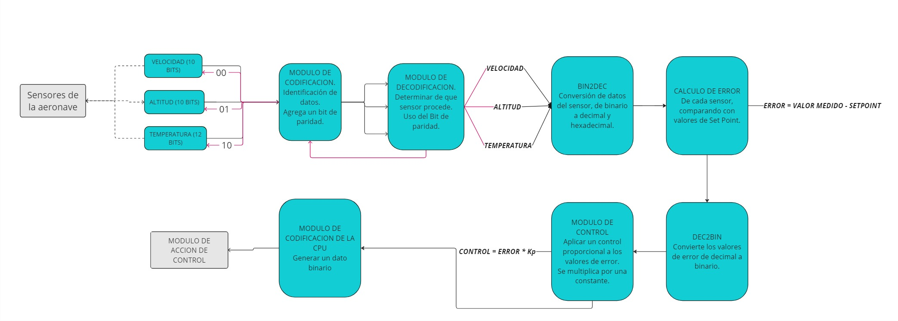

# ACTIVIDAD-2
## 1. Diagrama de bloques:

## 2. Casos de aplicación: 
### Velocidad:
#### Caso 1:
- Encabezado: 00
- Datos binarios: 0100110101
- Paridad: 1 (Impar)
- Valor Dec: 309 mph
- Set Point: 320 mph 
- Error: -11
- Error binario: 1111110100
- K_P: 1,5
- Control: -16,5
- Codificación CPU: 0001001101010000001
#### Caso 2:
- Encabezado: 00
- Datos binarios: 1010010100
- Paridad: 0 (par)
- Valor Dec: 660 mph
- Set Point: 650 mph 
- Error: 10
- Error binario: 0000001010
- K_P: 1,5
- Control: 15
- Codificación CPU: 0010100101000000000
#### Caso 3:
- Encabezado: 00
- Datos binarios: 0111101011
- Paridad: 0 (par)
- Valor Dec: 491 mph
- Set Point: 500 mph 
- Error: -9
- Error binario: 1111110110
- K_P: 1,5
- Control: -13.5
- Codificación CPU: 0001111010110000000
### Altitud:
#### Caso 1: 
- Encabezado: 01
- Datos binarios: 0000010101011101
- Paridad: 1 (impar)
- Valor Dec: 1373 ft
- Set Point: 1400 ft 
- Error: -27
- Error binario: 1111111111100100
- K_P: 1,2
- Control: -32,4
- Codificación CPU: 0100000101010111011
#### Caso 2:
- Encabezado: 01
- Datos binarios: 0000100101110100 
- Paridad: 1 (impar)
- Valor Dec: 2420 ft
- Set Point: 2500 ft 
- Error: -80
- Error binario: 1111111110101111
- K_P: 1,2
- Control: -96
- Codificación CPU: 0100001001011101001
#### Caso 3: 
- Encabezado: 01
- Datos binarios: 0001001110001101 
- Paridad: 0 (par)
- Valor Dec: 5005 ft
- Set Point: 5100 ft 
- Error: -95
- Error binario: 1111111110100000
- K_P: 1,2
- Control: -114
- Codificación CPU: 0100010011100011010
### Temperatura:
#### Caso 1:
- Encabezado: 10
- Datos binarios: 000000110110
- Paridad: 1 (impar)
- Valor Dec: 54°C
- Set Point: 50°C 
- Error: 4
- Error binario: 000000000100
- K_P: 0,8
- Control: 3,2
- Codificación CPU: 100000001101100000001
#### Caso 2:
- Encabezado: 10
- Datos binarios: 000001110011 
- Paridad: 0 (par)
- Valor Dec: 115°C
- Set Point: 110°C 
- Error: 5
- Error binario: 000000000101
- K_P: 0,8
- Control: 4
- Codificación CPU: 100000011100110000000
#### Caso 3: 
- Encabezado: 10
- Datos binarios: 000010101000 
- Paridad: 1 (impar)
- Valor Dec: 168°C
- Set Point: 160°C 
- Error: 8
- Error binario: 000000001000
- K_P: 0,8
- Control: 6,4
- Codificación CPU: 100000101010000000001
## 3. Conclusiones:
- El diseño de un sistema de control de variables para una aeronave demuestra la importancia de integrar múltiples módulos y sistemas. Cada componente, desde los sensores hasta la CPU, debe funcionar de manera coherente para garantizar una operación precisa y segura.
-  La conversión de datos binarios a decimales y viceversa es fundamental para la interpretación y procesamiento de la información.
- La actividad fue una oportunidad muy importante para comprender y aplicar conceptos clave de la ingeniería. 
